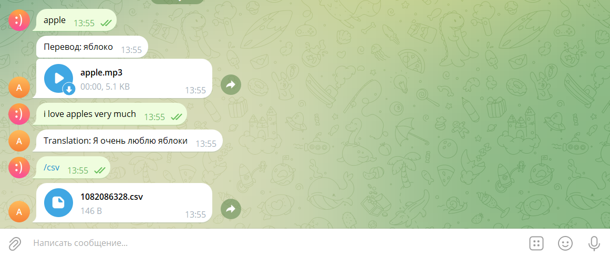

# AnkiBot

### Описание

Боту можно присылать английские слова / предложения. В случае перевода одного слова, бот будет парсить перевод + произношение с Cambridge Dictionary. Если же мы переводим целое предложение, бот может использовать Selenium в качестве парсера с Google Translate или же использовать Microsoft Translation API для перевода. 
Тем самым можно создавать сотни карточек и экономить большое количество времени.

### Чему я научился, пока писал этот проект?

Я познакомился с такими технологиями как:

- Selenium
- BeatiufulSoup
- Aiogram 3
